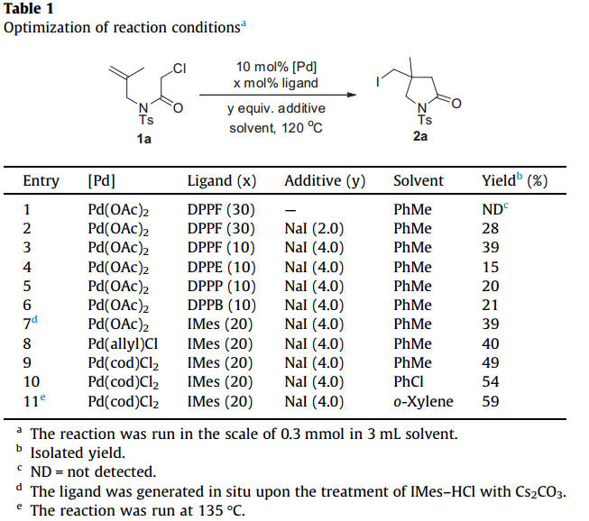
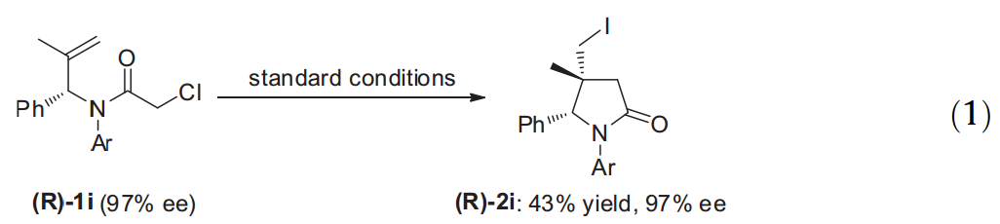
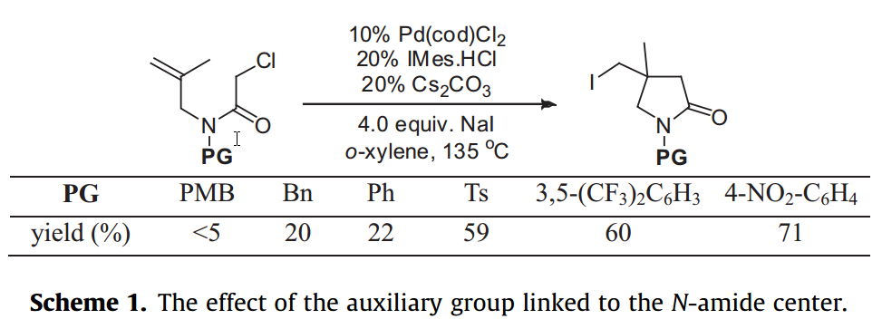
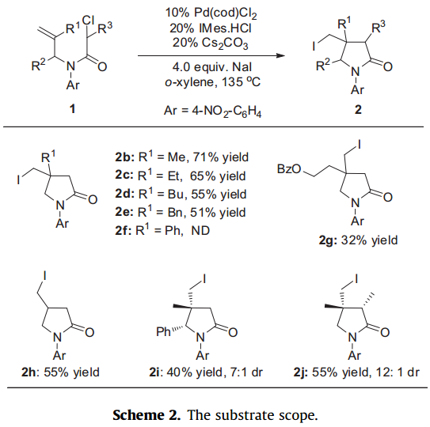
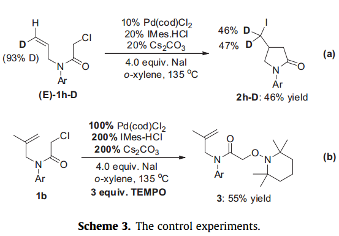
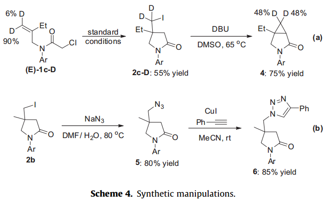

#
文献翻译

######
文献：Tetrahedron Letters 56 (2015) 4483–4485《Pd(0)-catalyzed atom transfer radical cyclization of N-allyl-α-chloroamides: highly stereoselective synthesis of substituted γ-lactam》
#####In addition to their versatile reactivity,1 γ-lactams are also an important substructure widely spreading in numerous biologically active compounds and natural products.2 Thus, it is no surprise that various efficient methods have been developed for their synthesis. Among them, one of the most useful methods is the atom transfer radical cyclization (ATRC) of N-allyl-α-haloamides.3 In this context, dichloro- and trichloro-amides are generally used as the starting materials. Moreover, both α-bromo amides and α-iodo amides also exhibit good activity under several specific reaction conditions.4 However, to the best of our knowledge, a-chloro amides are rarely investigated in the field of ATRC, presumably due to their inertness toward radical initiators. Herein, we report the Pd(0)-catalyzed atom transfer radical cyclizations of N-allyla-chloro amides 1 with the assistance of NaI additive, which provide a facile access to the substituted γ-lactams with good stereoselectivity.
#####除了它们通用的反应性，γ-内酰胺也是广泛散布在许多生物活性化合物和天然产物的重要成分。因此，多种有效的方法已经发展出来，用来合成他们的综合体也就不足为奇。其中一种最有用的方法是在原子间转移自由基环化N-烯丙基α-卤代酰胺的(ATRC)方法。在这种情况下，通常使用二氯和三氯酰胺作为原料。而且，不管是α-溴代酰胺还是α-碘酰胺在若干特定的反应条件下都表现出了良好的活性。然而，据我们所知，一氯酰胺由于他在反应中会表现出自由基引发剂惰性，因此很少被应用到ATRC领域研究。在此，我们报道钯(0)催化协助N-烯丙基氯酰胺与碘化钠间自由基环化的原子转移，对γ内酰胺的利息选择性简便存取提供了良好的方法。
#####Recently, we have disclosed that the Pd(OAc)2/DPPF catalysis system is an efficient radical initiator for the alkyl iodides.5 Thus,we commenced our study from the reaction of 1a using our previous reaction conditions\[Pd(OAc)2 (10mol%), DPPF(30mol%)\](Table 1, entry 1). To our disappointment, no reaction was observed, which might stem from the less activity of α-chloro amide. Therefore, we added NaI (2.0 equiv) into the reaction with the hope of converssion of 1a into the corresponding iodide in situ. Indeed, with the help of Nal (2.0 equiv), the desired product 2a was obtained albeit in 28% yield (Table 1, entry 2). Using 10 mol % DPPF ligand and 4.0 equiv Nal was found to be beneficial for the reaction, affording product 2a in 33% yield (Table 1, entry 3). Based on these results, several bisphosphine ligands, such as DPPE, DPPP as well as DPPB, were examined, which, however did not exhibit any superior performance over DPPF (Table 1, entries 4-6). Gratifyingly, the use of N-heterocyclic carbene ligand IMes gave product 2a in 40% yield (Table 1, entry 7). This result led us to further examine the catalyst precursor, which disclosed that PdCl2(cod) was the best choice (Table 1, entries 8 and 9). Finally, the solvent screening proved that o-xylene was the optimal one to deliver 2a in 59% yield, although a somewhat higher reaction temperature (135 ℃) was required (Table 1, entry 11).
#####最近，我们公开了醋酸钯/1,1-双(二苯基膦)二茂铁催化系统是烷基碘自由基反应的有效引发剂。因此，我们使用我们以前的反应条件\[加入醋酸钯(10mol％)，1,1-双(二苯基膦)二茂铁(30mol％)\](表1，条目1)我们开始研究1a的反应。令我们失望的是，没有观察到反应，这可能与α-氯代酰胺活性太低导致的。因此，我们加入NaI(2.0当量)，并在希望1a相应原位与碘化物发生转化反应。事实上，在碘化钠(2.0当量)的协助下生成物中所需的2a产物仅仅只有28％的产率(表1，条目2)。利用10mol％1,1-双(二苯基膦)二茂铁作为配位体额外添加4.0当量碘化钠被认为是该反应是有利的条件，生成物中最终获得2a产物产率为33%(表1，条目3)。基于这些结果，我们对几个双膦配体做了检验，例如1,2-双(二苯膦)乙烷 1,3-双(二苯基膦)丙烷以及1,1-双(二苯基膦)二茂铁，其余的几个双膦配体都没有表现出任何性能超过DPPF的表现(表1，条目4-6)。令人欣慰的，采用N-杂环卡宾配体的IMes，得到产物中2a产率达到了40％(表1，条目7)。这个结果使我们进一步考察了催化剂前体，其中透露出，(1,5-环辛二烯)二氯化钯(Ⅱ)是最好的选择(表1，条目8和9)。最后，筛选证实邻二甲苯是生成2a产率达到59％所能使用最好的溶剂，虽然所需反应温度稍微较高需要(135℃)(表1，条目11)。
#####In line with all the other approaches to lactam synthesis via the cyclization of N-unsaturated carbamoyl methyl radicals,6 the performance of ATRC usually is sensitive to the auxiliary group linked to the N-amide center likely due to the quite strong and rigid amide bond.7 Guided by these observations, several a-chloroa-mides with different auxiliary groups were prepared and were sub?jected to the standard conditions (Scheme 1). It was interesting to find that their electronic characteristic imposed a dramatic effect on the yield. The electron-rich auxiliary group exhibited much more inferiority than that of the electron-poor one, and the 4-ni- trophenyl group offered the best result with 71% yield (Scheme 1).
#####在经由N-二不饱和氨基甲酰基甲基自由基的环化的所有其他方法内酰胺合成路线，ATRC的性能通常是连接于N型酰胺中心可能在辅助组敏感由于相当强的和刚性的酰胺键。由这些观察引导，在标准条件下制备几个一氯模式与不同的对照组(方案1)。有趣的是，发现他们的电子学特性施加对产量产生巨大影响。富电子辅助组表现出比贫电子实验组次等，和4-硝基苯基提供最好结果产率达到71％(方案1)

#####With the optimal reaction conditions and auxiliary group identified, the reaction scope was then investigated and the results are summarized in Scheme 2. When the R1 substituent was an alkylgroup, such as methyl (2b), ethyl (2c), butyl (2d), benzyl (2e) as well as benzoyloxyethyl (2f), the reaction proceeded smoothly to afford the desired products in moderate yields (Scheme 2).However, no reaction was observed for substrate 1d with a phenyl R1 substituent, which was probably attributed to its large steric hindrance. Very interestingly, the reaction was applicable to substrate 1h with a hydrogen atom R1 substituent, leading to the isolation of product 2h in 55% yield and no observation of side Heck-product, which were largely different from the report of Mori’s group.8 Both the reactions of substrate 1i with a phenyl R2 substituent and 1j with a methyl R3 substituent brought about a stereoselective issue, affording products 2i and 2j with 7:1 and 12:1 diastereoselectivity, respectively (Scheme 2). The relative stereochemistry of 2i and 2j was established on the basis of the NOE experiment. It should be stressed that no loss of the enantiomeric excesses was observed in product 2i when enantioenriched substrate (R)-1i (97% ee)9 was subjected to the standard reaction conditions (Eq. 1).
#####该反应范围内用的最佳反应条件和识别的辅助基团，然后调查，结果总结在方案2中，当R 1的取代基是烷基时，例如甲基(2b)，乙基(图2c)，丁基(2d)，苄基(2e)以及苄氧乙基(2f)，反应皆能够顺利进行，得到所需产物达到中等产率(方案2)。然而，没有观察到基板体1d与苯基R1取代基的反应，其可能是由于它们之间的空间位阻太大。非常有趣的是，反应使用氢原子R1取代基作为底物反应1小时后，2小时后分离产物产率为55％，没有观察侧Heck产物，这与由森的小组报告有很大不同。两者的基板1i与苯基R2取代基和1j与带来的立体选择性问题甲基R3取代基，得到的产品2i和2j的7反应：1和12：1非对映选择性，分别为(方案2)。2i和2j的相对立体化学建立在NOE实验的基础上。应当强调的是，在标准反应条件进行产品2i反应没有观察到对映体过量的损失时富对映体衬底(R)-1i(97％ee)(Eq.1)。

#####To investigate the mechanism of this Pd(0)-catalyzed cyclization, two control experiments were conducted. When (E)-1h-D (93% D) was subjected to the standard conditions, 2h-D was obtained in 46% yield with even deuterium scrambling (46% vs 47%) (Schame 3a). Apparently, the observation of deuterium scrambling seems to support a radical-involving process. Thus,
#####为了研究该钯(0)催化的环化反应的机制，控制两个变量进行了实验。当(E)-1h-D(93％D)进行标准的条件下，产率为46％与氘扰(46％比47％)(流程3A)中得到2h-D。显然，观察到氘似乎涉及支持自由基反应过程。从而，

#####TEMPO (3.0 equiv) was introduced into the reaction of 1b under the standard conditions, which completely suppressed the reaction. When stoichiometric amount of palladium catalyst was used,the TEMPO adduct 3 was isolated in the yield of 55% (Schame 3b).These results strongly demonstrated that the Pd(0)-catalyzed reaction proceed via a ATRC mechanism.10
#####四甲基哌啶氮氧化物(3当量)被引入到标准条件下1b的反应中，完全压制了反应。当在反应中使用一定化学计量的钯催化剂是，四甲基哌啶氮氧化物加合物3反应后的分离产率为55%(方案3b)。这些结果强烈表明，钯(0)催化剂经由ATRC机制继续参与反应。
#####To further expand the synthetic utility of the reaction, we wished to demonstrate that the resulting products could be readily manipulated (Scheme 4). Upon the treatment of DBU, compound 2c-D, which was produced from (E)-1c-D using the standard conditions, could be transformed to 3-azabicyclo[3.1.0]hexan-2-one derive 4 in 75% yield (Schame 3a). Moreover, alkyl azide 5 was readily obtained from product 2b, which could be further converted into triazole 6 using a CuI-catalyzed click reaction (Schame 3b).
#####进一步扩大反应的合成效用，我们希望证明可以容易地操纵反应获得所需产物(方案4)。在1,8-二氮杂二环十一碳-7-烯上处理，复合生成2C-D，是由(E)-1c-D在标准条件下反应产生的，可转化为3-氮杂二环[3.1.0]己烷-2-酮，得到产率在75％ 4 (方案3a)。此外，5地从产物2b中很容易得到烷基叠氮化物，这可能会使用的CuI催化激发反应进一步转化得到三唑 6 (方案3b)

#####In summary, we have realized the atom transfer radical cyclizations of N-allyl-a-chloroamides in the presence of Pd(COD)Cl2/IMes catalyst and NaI additive, which provides a convenient way to substituted γ-lactams. The ATRC mechanism is supported by the results from the reaction of deuterated substrate and the TEMPO trapping experiment.
#####总之，我们已经实现了加入(1,5-环辛二烯)二氯化钯(Ⅱ)/IMES催化剂和碘化钠添加剂，提供了一个方便的方法来取代的γ内酰胺的存在下N-烯丙基一氯酰胺的原子转移自由基环化。该原子转移自由基聚合机理从氘化衬底的反应和四甲基哌啶氮氧化物捕集实验的结果作为支持。
#---------------------------------------------------------------------#
文献：Chem. Rev. 2007, 107, 133?173《Carbon?Carbon Coupling Reactions Catalyzed by Heterogeneous Palladium Catalysts》
#Catalysts
#####Solid-supported catalysts are complex assemblies. Their preparation is a challenging task. Minor changes of their preparation conditions can significantly influence the delicate balance of conflicting demands: high activity, high selectivity, and long lifetime. Palladium can be deposited on a solid support in different ways.14 The preferred mode of deposition depends also on the type of support. With oxides and carbon supports, wet or dry impregnation, deposition-precipitation,deposition-reduction, and ion-exchange methods can be applied using most often an aqueous solution of a suitable Pd(Ⅱ) precursor, such as PdCl2, \[Pd(NH3)4\]Cl2, Pd(NO3)2, H2-PdCl4, or \[Pd(NH3)4\](NO3)2. On the other hand, organic solutions of Pd(0) complexes, such as Pd(acac)2 (acac=acetylacetone) or Pd(C3H5)2 are also sometimes used.14 Metal oxide surfaces are hydroxylated as such or become hydroxylated in the presence of aqueous Pd(Ⅱ) solutions. Pretreatment of carbon in an oxidizing environment is used to introduce oxygen-containing surface groups, thus enhancing the interaction with the metal. The catalyst obtained by the different methods can later on be calcined. This thermal treatment often overrides the prior application of the Pd precursor to the solid support as far as the ultimate metal dispersion is concerned. On the other hand, the surface of the support can be covalently functionalized by ligands, such as phosphines, pyridines, or mercaptanes, which form complexes with dissolved Pd salts. This methodology is widely used in polymer-46 and silica-supported47 palladium catalysts. Grafting of Pd complexes to the solid support by starting with a Pd complex bearing linker groups in the ligands is another method to prepare solid-supported Pd catalysts.48
#####固体载体上的催化剂是复杂的装配。这些标准的制定是一项艰巨的任务。其制备条件的微小变化可以显著影响相互冲突的需求的微妙平衡：高活性，高选择性，寿命长等优点。钯可以以不同的方式在固相载体沉积。沉积的优选方式还取决于支持的类型。通过与氧化物和碳载体，潮湿或干燥的浸渍，沉积-沉淀，沉积减少，和离子交换方法可以最大程度上使用一个合适的钯(Ⅱ)的前体。通过与氧化物和碳载体，潮湿或干燥的浸渍，沉积-沉淀，沉积减少，和离子交换方法可以最大程度上使用一个合适的钯(Ⅱ)的前体，例如：PdCl2, \[Pd(NH3)4\]Cl2, Pd(NO3)2, H2-PdCl4, or \[Pd(NH3)4\](NO3)2另一方面，钯的有机溶液(0)配合物，例如：Pd(acac)2(乙酰丙酮=乙酰丙酮)或Pd(C3H5)2有时也用于实验。金属氧化物表面被羟基化，或者因为水溶液中有Pd(Ⅱ)的存在变得羟基化。在氧化环境中的碳的预处理从而引入含氧表面基团，从而提高了与金属的相互作用。通过不同的方法获得的催化剂可以稍后被煅烧。该热处理通常覆盖钯前体与固体载体上，只要最终的金属分散即可事先应用。另一方面，载体的表面可以被共价配体通过，如膦，吡啶，或硫醇，它们形成配合物与溶解的钯盐官能团。这种方法被广泛用于聚合物和二氧化硅负载的钯催化剂。钯复合物通过与配体的钯络合物轴承连接基团起始固体载体的接枝是制备固体负载的钯催化剂的另一种方法
#####Sol-gel processes can also be used for the preparation of solid-supported Pd catalysts, mainly for silica- and aluminasupported Pd catalysts. The support is generated from a monomer, such as tetraethoxysilane or aluminum isopropoxide in the presence of a soluble Pd compound, such as PdCl2, Pd(NH3)4Cl2, or Pd(acac)2 (coprecipitation) and eventually a linker. In this way, usually amorphous materials are obtained, where a part of the Pd is encapsulated. Again these systems can be calcined later on.
#####溶胶-凝胶工艺也可以用于固体负载钯催化剂的制备中，主要为二氧化硅和氧化铝负载的钯催化剂。该载体由单体生成的，如在可溶性钯化合物的存在下，如四乙氧基硅烷加入或异丙醇铝，加入:PdCl2, Pd(NH3)4Cl2, or Pd(acac)2共沉淀)和最终的接头。以这种方式，可以得到通常的无定形材料，其中，钯的一部分被封装。另外，这些体系可在以后进行锻烧。
#####Although the active species in Pd-catalyzed cross-coupling reactions is Pd(0), the metal can generally be used as Pd(0) or Pd(Ⅱ)28 on the solid support. In the latter case, in situ reduction to Pd(0) occurs during the application in crosscoupling reactions without the addition of extra reducing reagents, that is, an amine, a phospine used as ligand, or a reactant reduces the Pd(Ⅱ) species. In the case of carbonsupported Pd, part of the Pd(Ⅱ) is already reduced to Pd(0) during the preparation of the catalyst. On the other side,transformation of Pd(Ⅱ) into Pd(0) can be implemented by an extra reduction step, for example, by hydrazine, formaldehyde, or hydrogen, or occurs already in its preparation,when the deposition-reduction methodology is used. Gasphase reduction leads to smaller Pd particles than liquidphase reduction.14 Generation of the Pd(0) from Pd(Ⅱ) at the solid support can often be advantageous because species are generated, which exhibit a higher catalytic activity.
#####虽然在钯催化交联偶合反应的活性种为钯(0)，该金属通常可以用作在固体载体上的钯(0)或钯(Ⅱ)。在后一种情况下，在原位还原到钯(0)不加入额外的还原剂的在交叉偶联反应中的应用过程中发生，即，胺，用作配位体的三氢化磷，或反应物降低的钯(Ⅱ)的种类。在载钯，钯(Ⅱ)的一部分的碳的情况下，催化剂的制备期间已经减少到的钯(0)。在另一侧，钯(Ⅱ)的成的钯(0)相变可以通过一个额外的还原步骤来实现，例如，通过肼，甲醛或氢，或在其准备已经发生时，当沉积还原方法是用过的。气相减少导致更小的钯微粒比液相还原。选自钯(Ⅱ)在固体载体上的钯(0)的产生经常是有利的，因为物种中产生，其显示出较高的催化活性。
#####A loading with 5 wt % Pd is used for most of the Pd catalysts; however, for special purposes higher loadings are used. On the other hand, cases were reported where the catalyst loading went through an optimum, that is, higher Pd loadings decreased the activity.49 Important parameters of the active metal are the surface area, the dispersion(typically only 10-60% of the metal atoms are exposed),the size of the crystallites (typically in a range of 2 to >20nm), the location in the pores of the support, the oxidation state, the counter ions if Pd(Ⅱ) is used, the water content,and the conditions of its preparation.7,50
#####用5wt％钯的装载用于大多数的钯催化剂;然而，对于特殊的目的会使用较高负载。另一方面，据报的情况下催化剂负载通过一个最佳方法通过降低活性实现更高的钯负载量。活性金属的重要的参数是表面积，分散体(通常只有10-60％的金属原子裸露在外)，微晶的尺寸(代表性范围值是2到>20nm)，在该支持范围内，它的制备的条件取决于氧化状态孔中的抗衡离子如钯(Ⅱ)以及水含量。
#####The support usually has an impact on the activity of the catalytic system. Particle size, surface area, pore structure,and acid-base properties are important parameters of the support.7 The support can affect the catalyst activity either by creating reactive spots at the Pd metal crystallites51-53 or by improved release of Pd(0) into the solution by leaching.11,13,54 In the latter case, the genuine catalytic system is homogeneous (Vide infra). Basic supports such as basic zeolites, layered double hydroxides, or sepiolites can play a similar supporting role as phosphines in homogeneous catalysis49,55,56 or can act as bases,57 that is, no external bases are necessary in these cases.
#####支撑有时会对催化系统的活性产生影响。粒径，表面积，孔结构和酸碱性是载体的重要参数。载体可以通过创建在所述钯金属微晶反应斑点或由改良的钯(0)的释放到由浸出溶液影响催化剂的活性。在后一种情况下，真正的催化体系是均相的(见下文)。基本载体如基本沸石，层状双氢氧化物，或海泡石可以在均相催化发挥膦类似配角或可作为碱起作用，即，没有外部的碱是在这些情况下是必要的。
#####Due to their controlled pore size, microporous and mesoporous materials, such as zeolites, can be advantageous over simple metal oxides. Pd(0) clusters can be encapsulated in these pores. The pore size and structure of such supports can have an important impact on the reactivity and selectivity of those catalysts.58 Thus, cases were reported where a larger pore size of mesoporous silica allowed reaction of larger substrates as compared with microporous supports.58
#####取决于它们的受控孔径，微孔和中孔材料，如沸石，可以有利的超过简单的金属氧化物。钯(0)集群可以在这些孔进行封装。孔尺寸和这样的载体的结构对这些催化剂的反应性和选择性有重要影响。因此，报告的情况下介孔二氧化硅有较大的孔径允许更大尺寸玻璃基板的反应与微孔支撑比较。
#####Pd on solid supports can be used as such or in combination with additional soluble ligands, such as phosphines, carbenes,and amines. It is assumed that such ligands support leaching of Pd into the solution acting as homogeneous catalyst there.59 In other cases, the addition of ligands, such as phosphines, inhibits the reaction rather than accelerates.7,60 As in homogeneous cases, heterogeneously catalyzed Heck reactions can be promoted by ammonium salts.61
#####在固体载体上的钯可这样子使用，或与另外的可溶性配体，如膦，卡宾和胺进行组合。据推测，这样的配体支持的钯浸出到作为均相催化剂存在的溶液中。在其他情况下，除了配体，如膦，表现抑制反应，而不是的加速。作为均质的情况下，非均相催化的Heck反应可通过铵盐得到促进。
#####A number of solid-supported Pd catalysts are commercially available. However, they often differ in structure (support and Pd), composition, and activity depending on the supplier. Laboratory chemical suppliers normally do not specify the catalyst manufacturer and the exact catalyst type. For optimization of a catalytic system for larger scale production,it is necessary to have contact with the supplier to get always the same quality of supported Pd or to buy a stock of material in order to guarantee the reproducibility of results. When synthetic chemists want to apply methods reported in the literature for heterogeneous catalysis, they should be sure to get the same or similar catalyst as reported in the procedure. Differences from the originally used system can cause unwanted effects.
#####许多固体负载钯催化剂是市售的。然而，它们通常在结构(和钯支持)，组合物不同，并且活性取决于供应商。实验室化学品供应商通常不指定催化剂制造商和确切的催化剂类型。对于较大规模的生产的催化体系的优化，这是必要的，以具有与供应商联系，总是得到支持的钯的相同质量或买材料的库存，以保证结果的可重复性。当合成化学家要应用在文献中用于多相催化方法的报道，它们应确保作为程序报告以获得相同的或类似的催化剂。与原来使用的系统存在差异可能会产生意想不到的效果。
#####The characterization of a heterogeneous Pd catalyst on a molecular level is still a problem, although TEM, X-ray diffractometry, and IR spectroscopy allow important insights into the structure. Often, heterogeneous catalysts are still chosen on an empirical basis without understanding why a given catalyst is superior to another one.
#####在分子水平上的非均相钯催化剂的表征仍然是一个问题，虽然透射电子显微镜，X射线衍射法和红外光谱法提供了重要见解的结构。通常情况下，非均相催化剂仍在经验基础上选择，而不理解为什么给定的催化剂优于另一个。
#####Reusage of a heterogeneous catalyst is often possible but is sometimes limited due to leaching of the Pd without redeposition (leaching up to 14% Pd from Pd/C was observed in Heck reactions62), changing of crystallite structure of the Pd on the support surface,28,50 chemical change of Pd ligands(e.g., oxidation of phosphanes leading to high leaching of Pd) grafted to the solid support, or congesting the catalyst surface, for example, by salts formed as byproducts in the coupling reaction.58 There were cases reported where the catalytic activity dropped considerably in the second run,while marginal losses of catalytic activity were observed in the following runs.58 Reuse of catalytic Pd can also be achieved, when colloidal Pd is formed by leaching from the support and these colloidal particles are separated and submitted to another run.38 Interestingly, there are a few cases reported where the recycled catalyst exhibited higher activity than the original one.52
#####多相催化剂的重复使用是普遍的，但有时也是有限的，由于钯的浸出未经再沉积(钯在Heck反应中观察到的选自钯/碳浸出高达14％)，该载体表面上的钯的微晶结构的变化，钯的配位体的化学变化(例如，膦导致钯高浸出的氧化)接枝到固体支持物，或阻塞在该催化剂表面上，例如，通过形成为在偶合反应的副产物盐。还有，其中的催化活性在第二次运行大幅度下降，而在下面的运行中观察到催化活性的边际损失报告案例。当胶体钯用从支承浸出和这些胶体粒子被分离，催化性钯重用也可以实现，并传递给另一个进程反应形成。有趣的是，有报道，少数案例报道其中循环催化剂比原来显示出较高的活性。
#####Palladium metal without a solid support has rarely been used in cross-coupling reactions.40,63,64 Palladium on charcoal (also called activated carbon) (Pd/C) is by far the most often used catalyst in heterogeneous Pd-catalyzed coupling reactions. It can be purchased from various laboratory suppliers,such as Acros, Aldrich, Lancaster, or Alfa Aesar, or from the manufacturers Degussa or Johnson Matthey in various qualities with a Pd content ranging from 1% to 20%. The materials can contain water up to 50%. Pd/C is used with or without additional ligands. Procedures for the preparation of Pd/C were reported.14,65
#####无固体支持物的钯金属很少在交叉偶联反应中使用。钯碳(也称为活性炭)(钯/碳)是迄今为止在多相钯催化的偶联反应中最常用的催化剂。它可以从不同的实验室供应商，如孔口，阿德里奇公司，兰开斯特，或阿法埃莎，或者从制造商德固赛公司或庄信万丰， 在具有Pd含量范围为1％至20％的各种质量购买。该材料可含水高达50％。钯/碳的使用有或没有附加配体。钯/碳的制备步骤已被报道。
#####Cross-couplings catalyzed by solid-supported Pd can be carried out in organic solvents. Organic solvent/water mixtures were also used, and a few cases were reported using ionic liquids12,66-69 or working under solvent-free conditions.
#####通过固载钯催化的交叉偶联可以在有机溶剂中进行。有机溶剂/水混合物也可以使用，以及一些情况下使用离子液体或无溶剂的条件下反应环境也已报道过。

